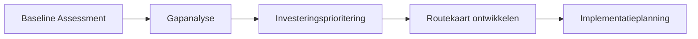

---
tags:
  - digitale-transformatie-en-industrie-40-50
  - live
title: Digitale transformatie implementatie principes
---
_Digitale transformatie implementatie principes_ beschrijft de fundamentele uitgangspunten, richtlijnen en spelregels voor de praktische uitvoering van digitalisering in industriële bedrijven.

## Definitie

**Digitale transformatie implementatie principes** zijn de systematische uitgangspunten voor de uitvoering van digitalisatiestrategie in industriële bedrijven. Het omvat zowel de volwassenheidsmeting (DTMA) als de praktische principes om van losse productiesystemen te groeien naar een volledig verbonden fabriek volgens [[industrie-4.0|Industrie 4.0]]-principes.

> [!important] Kernuitgangspunt  
> Implementatie start altijd met een grondige [[**maturity assessment (DTMA)** om de huidige digitale status vast te stellen.

De implementatie volgt het [[7-stappen-digitale-transformatie|bewezen stappenplan]] en gebruikt de [[unified-namespace|UNS-architectuur]] als technische ruggengraat.

## Strategische uitgangspunten

### Data als primaire commodity

> [!tip] Fundamenteel principe Om echt een [[industrie-4.0|Industrie 4.0]] bedrijf te worden moet je als eerste **data de primaire commodity** van je business maken. Dit houdt in dat je effectief digitaal moet transformeren om ervoor te zorgen dat eigenlijk alles wat data produceert wat relevant kan zijn voor je business structureel opgeslagen wordt, gedeeld kan worden met de business en in een logische architectuur opgeslagen wordt.

**Transformatie doelstellingen:**

- **Papierloos werken** - Volledige digitale processen
- **Geïntegreerd werken** - Naadloze samenwerking tussen systemen
- **Data gebruiken om te verbeteren** - Continue procesoptimalisatie
- **Van gesilode processen** naar geïntegreerde digitale bedrijfsvoering
- **Van reactief werken** naar proactieve besluitvorming op basis van data

## Implementatie principes

### Proces principes

**Stapsgewijze aanpak:**

1. **Strategie bepalen** - [[unified-namespace|Unified Namespace (UNS)]] als uitgangspunt
2. **Bedrijf inventariseren** - Huidige processen en systemen in kaart brengen
3. **Minimale technische vereisten** vaststellen
4. **Proof of Concept** definiëren - Begin met 1 functie op 1 machine
5. **Verbinden, verzamelen, opslaan, visualiseren, analyseren, patronen herkennen, rapporteren en oplossen**
6. **Tweede functie toevoegen** aan dezelfde machine
7. **Uitbreiden** naar meer machines en meer functies

**Continue focus principes:**

- Focus op de technologie
- Adaptief en geïnteresseerd in nieuwe ontwikkelingen
- Bereid om fouten te maken, ervan te leren en door te gaan

### Digital Transformation Maturity Assessment (DTMA)

> [!note] DTMA-framework  
> Systematische evaluatie langs 5 niveaus: **Reactief** → **Gedefinieerd** → **Geïntegreerd** → **Geoptimaliseerd** → **Adaptief**.

**Beoordelingsdimensies:**

- **Technologie-infrastructuur**: IT/OT-landschap en productie-/informatiseringssystemen
- **Datamanagement**: Datakwaliteit, governance en analysecapaciteiten
- **Procesdigitalisering**: Automatiseringsgraad en systeemintegratie (van werkvloer tot kantoor)
- **Organisatie & cultuur**: Verandermanagement en digitale vaardigheden
- **Klantbeleving**: Digitale interactie en dienstverlening richting klanten en toeleverketen

**Voorbereidingsfase principes:**

- **DTMA uitvoeren**: Systematisch de huidige digitale volwassenheid bepalen
- **Strategie opstellen**: Het waarom, wat en hoe van de transformatie definiëren
- **Architectuur ontwerpen**: [[unified-namespace|UNS]] plannen als centrale datalaag
- **[[minimale-technische-vereisten-MTR|Minimale technische vereisten]]** vaststellen
- **Businesscase**: ROI-onderbouwing op basis van vastgestelde gaps

**Pilot/Proof of Concept principes:**

- **Eén functie, één machine**: Beperkte, herkenbare scope voor een eerste succes
- **Snel tot probleemoplossing**: Focus op waarde leveren in plaats van perfecte architectuur
- **Dataverzameling**: Sensoren/connectoren plaatsen op een gekozen lijn of cel
- **Basisdashboard**: Eerste visualisatie van realtime machinedata ([[overall-equipment-effectiveness|OEE]], stilstanden, kwaliteit)
- **Iteratieve uitbreiding**: Stapsgewijs opschalen naar meer functies/machines

## Organisatie principes

### Team principes

> [!team] Multidisciplinair implementatieteam  
> Combineer technische expertise met proceseigenaarschap voor blijvend resultaat.

**Interne kernteam (2 tot 4 mensen):**

- **Leider digitale transformatie**: Strategische sturing en bestuurlijke rapportage
- **IIoT-specialist**: Implementatie van sensoren, netwerken en connectiviteit
- **Data-analist**: Patronen herkennen en inzichten genereren uit productiedata
- **Procesanalist**: Brug tussen digitale mogelijkheden en (lean) bedrijfsprocessen

### Externe ondersteuning principes

**Consultant principe:**

- Je moet niet bouwen op algemene generieke consultants
- Industrie moet PROBLEMEN oplossen en gedreven worden door mensen die het al gedaan hebben en technisch onderlegd zijn
- Gebruik integrators die iets soortgelijks hebben gebouwd en die probleemgeoriënteerd zijn
- Voorwerk eerst doen: digitale strategie, bedrijfsinventarisatie, architectuurmodel, minimale technische vereisten

**Stakeholder principes:**

- **Directie/MT**: Digitale visie, prioritering en budget
- **IT-management**: Beheer, security en infrastructuur
- **Productie/Operations**: Procesdigitalisering en verandermanagement op de werkvloer
- **Financiën**: ROI-tracking en investeringsonderbouwing

## Software principes

### Gefaseerde software-aanpak

**Evolutie principe:**

- **Start klein**: Begin goedkoop of gratis en voeg duurdere componenten toe bij opschaling. Open-source bouwstenen ([[mqtt|MQTT]], InfluxDB, Grafana)
- **Schaal gefaseerd**: Problemen oplossen zonder teveel technische schuld, daarna migreren naar duurdere oplossingen. Enterprise-platformen (Ignition, industriële historians)
- **Groei naar volwassenheid**: Geavanceerde analyses en machine-learningtoepassingen

### Hosting principes

**Infrastructure principe:**

- Standaard on-premise (vooral voor opslag) en dan data naar cloud verplaatsen wanneer dat nodig is om specifieke problemen op te lossen

### Integratie principes

**Architectuur principe:**

- Zorg dat minimale technische vereisten en architectuurmodel toestaan dat elk component vervangen kan worden met minimale impact op andere nodes
- [[unified-namespace|Unified Namespace]] als centrale datahub voor alle systemen
- [[enterprise-resource-planning|ERP]] als systeemnode in plaats van centraal systeem
- [[manufacturing-execution-system|MES]] voor productiebesturing

## Technologie principes

### AI en geavanceerde technologieën

**Volgorde principe:**

- [[kunstmatige-intelligentie|AI]] en [[machine-learning|ML]] komen als laatste in de volgorde
- Eerst de basis leggen met betrouwbare dataverzameling en -opslag
- Dan bouwen naar voorspellende en optimaliserende toepassingen
- Waarde leveren met eenvoudige visualisatie en analyse voordat geavanceerde technieken worden toegepast

## Meetprincipes

### Kernprestatie-indicatoren (KPI's)

> [!metrics] DTMA-meetindicatoren  
> Kwantitatieve monitoring van de voortgang en bedrijfswaarde.

- **Digital Readiness Score**: Algehele digitale gereedheid (0–100)
- **Adoptiesnelheid van technologie**: Tempo van implementatie en gebruik
- **Data-benuttingsindex**: Effectiviteit van data voor besluitvorming en continu verbeteren
- **Procesautomatiseringsniveau**: Automatiseringsgraad van kritische processen

> _Praktijktip voor NL-fabrieken:_ koppel bovengenoemde KPI's aan bestaande operationele stuurgetallen zoals **[[overall-equipment-effectiveness|OEE]]**, **doorlooptijd** en **first-pass yield** voor direct zicht op waardecreatie.

## Verwante termen

- [[digitale-transformatie|Digitale transformatie]] – Overkoepelende strategie
- [[7-stappen-digitale-transformatie|7-stappenmodel]] – Methodische aanpak
- [[manufacturing-execution-system|MES]] – Schakelsysteem tussen werkvloer en kantoor
- [[data-acquisitie|Data-acquisitie]] – Technische dataverzameling

## Verwante concepten

- [[change-management|Verandermanagement]] – Organisatorische borging
- [[industrial-internet-of-things|Industrial IoT]] – Technische basisinfrastructuur
- [[unified-namespace|Unified Namespace]] – Centrale data-architectuur
- [[edge-computing|Edge computing]] – Lokale dataverwerking nabij de bron
- [[erp-als-systeemnode|ERP als systeemnode]] – Moderne rol van bedrijfssystemen

## Bronnen

- Walker Reynolds – Digital Transformation Maturity Assessment (DTMA)
- Mark O'Donovan (4.0 Solutions Discord) – Praktische implementatie-aanpak
- Plattform Industrie 4.0 (Duitsland) – Implementatierichtlijnen
- Smart Industry (Nederland) – Praktische implementatiegidsen
- McKinsey – Studies "Connected Manufacturing"
- Deloitte – Methodiek "Industry 4.0 Readiness Assessment"

---

← Terug naar [[digitale-transformatie|Digitale transformatie]]