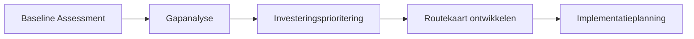

---
tags:
  - digitale-transformatie-en-industrie-40-50
  - live
title: Digitale transformatie implementatie
---
_Implementatie van digitale transformatie_ beschrijft de praktische uitvoering van digitalisering in metaalfabrieken, inclusief volwassenheidsanalyse, organisatorische aanpak en gefaseerde uitrol.

## Definitie

**Implementatie van digitale transformatie** is de systematische uitvoering van de digitalisatiestrategie in metaalverwerkende bedrijven. Het omvat zowel de volwassenheidsmeting (DTMA) als de praktische stappen om van losse productiesystemen te groeien naar een volledig verbonden fabriek volgens [[industrie-4.0|Industrie 4.0]]-principes.

> [!important] Kernuitgangspunt  
> Implementatie start altijd met een grondige **maturity assessment (DTMA)** om de huidige digitale status vast te stellen.

De implementatie volgt het [[7-stappen-digitale-transformatie|bewezen stappenplan]] en gebruikt de [[unified-namespace|UNS-architectuur]] als technische ruggengraat.

## Toepassing

### Fase 0: Digital Transformation Maturity Assessment (DTMA)

> [!note] DTMA-framework  
> Systematische evaluatie langs 5 niveaus: **Reactief** → **Gedefinieerd** → **Geïntegreerd** → **Geoptimaliseerd** → **Adaptief**.

**Beoordelingsdimensies:**

- **🏗️ Technologie-infrastructuur**: IT/OT-landschap en productie-/informatiseringssystemen
    
- **📊 Datamanagement**: Datakwaliteit, governance en analysecapaciteiten
    
- **⚙️ Procesdigitalisering**: Automatiseringsgraad en systeemintegratie (van werkvloer tot kantoor)
    
- **👥 Organisatie & cultuur**: Verandermanagement en digitale vaardigheden
    
- **🎯 Klantbeleving**: Digitale interactie en dienstverlening richting klanten en toeleverketen
    

**Voorbereidingsfase (maanden 1–6):**

- **DTMA uitvoeren**: Systematisch de huidige digitale volwassenheid bepalen
    
- **Strategie opstellen**: Het waarom, wat en hoe van de transformatie definiëren
    
- **Architectuur ontwerpen**: [[unified-namespace|UNS]] plannen als centrale datalaag
    
- **Businesscase**: ROI-onderbouwing op basis van vastgestelde gaps
    

**Pilot/Proof of Concept (maanden 4–8):**

- **Eén functie, één machine**: Beperkte, herkenbare scope voor een eerste succes
    
- **Dataverzameling**: Sensoren/connectoren plaatsen op een gekozen lijn of cel
    
- **Basisdashboard**: Eerste visualisatie van realtime machinedata (OEE, stilstanden, kwaliteit)
    
- **Iteratieve uitbreiding**: Stapsgewijs opschalen naar meer functies/machines
    

### Organisatie & teams

> [!team] Multidisciplinair implementatieteam  
> Combineer technische expertise met proceseigenaarschap voor blijvend resultaat.

**Kernteam:**

- **🎯 Leider digitale transformatie**: Strategische sturing en bestuurlijke rapportage
    
- **🔧 IIoT-specialist**: Implementatie van sensoren, netwerken en connectiviteit
    
- **📈 Data-analist**: Patronen herkennen en inzichten genereren uit productiedata
    
- **⚙️ Procesanalist**: Brug tussen digitale mogelijkheden en (lean) bedrijfsprocessen
    

**Stakeholderbetrokkenheid:**

- **Directie/MT**: Digitale visie, prioritering en budget
    
- **IT-management**: Beheer, security en infrastructuur
    
- **Productie/Operations**: Procesdigitalisering en verandermanagement op de werkvloer
    
- **Financiën**: ROI-tracking en investeringsonderbouwing
    

**Software-evolutie:**

- **Start (maanden 1–18)**: Open-source bouwstenen (MQTT, InfluxDB, Grafana)
    
- **Opschalen (vanaf 18 maanden)**: Enterprise-platformen (Ignition, industriële historians)
    
- **Volwassen fase**: Geavanceerde analyses en machine-learningtoepassingen
    

### Kernprestatie-indicatoren (KPI’s)

> [!metrics] DTMA-meetindicatoren  
> Kwantitatieve monitoring van de voortgang en bedrijfswaarde.

- **Digital Readiness Score**: Algehele digitale gereedheid (0–100)
    
- **Adoptiesnelheid van technologie**: Tempo van implementatie en gebruik
    
- **Data-benuttingsindex**: Effectiviteit van data voor besluitvorming en continu verbeteren
    
- **Procesautomatiseringsniveau**: Automatiseringsgraad van kritische processen
    

> _Praktijktip voor NL-fabrieken:_ koppel bovengenoemde KPI’s aan bestaande operationele stuurgetallen zoals **OEE**, **doorlooptijd** en **first-pass yield** voor direct zicht op waardecreatie.

## Verwante termen

- [[digitale-transformatie|Digitale transformatie]] – Overkoepelende strategie
    
- [[7-stappen-digitale-transformatie|7-stappenmodel]] – Methodische aanpak
    
- [[manufacturing-execution-system|MES]] – Schakelsysteem tussen werkvloer en kantoor
    
- [[data-acquisitie|Data-acquisitie]] – Technische dataverzameling
    

## Verwante concepten

- [[change-management|Verandermanagement]] – Organisatorische borging
    
- [[industrial-internet-of-things|Industrial IoT]] – Technische basisinfrastructuur
    
- [[unified-namespace|Unified Namespace]] – Centrale data-architectuur
    
- [[edge-computing|Edge computing]] – Lokale dataverwerking nabij de bron
    

## Bronnen

- Walker Reynolds – Digital Transformation Maturity Assessment (DTMA)
    
- Plattform Industrie 4.0 (Duitsland) – Implementatierichtlijnen
    
- Smart Industry (Nederland) – Praktische implementatiegidsen
    
- McKinsey – Studies “Connected Manufacturing”
    
- Deloitte – Methodiek “Industry 4.0 Readiness Assessment”
    

---

← Terug naar [[digitale-transformatie|Digitale transformatie]]