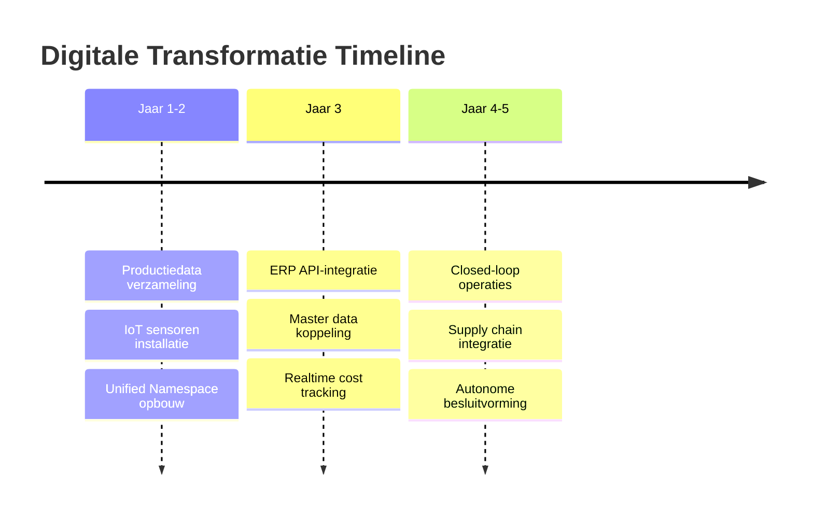

---
tags:
  - softwaredeployment-en-architectuur
  - digitale-transformatie-en-industrie-40-50
  - live
title: ERP als systeemnode
---
*ERP als systeemnode* beschrijft waarom bedrijfssystemen onderdeel moeten zijn van een bredere digitale architectuur, niet de centrale spil waar alles omheen draait. Deze benadering is essentieel voor succesvolle [[digitale-transformatie|digitale transformatie]] in de metaalindustrie.

## Definitie

**ERP als systeemnode** betekent dat [[enterprise-resource-planning|ERP-systemen]] functioneren als één van de vele verbonden componenten binnen een [[unified-namespace|Unified Namespace]] architectuur. Het ERP levert en consumeert data via gestandaardiseerde interfaces, parallel aan andere systemen zoals [[manufacturing-execution-system|MES]], SCADA en [[industrial-internet-of-things|IIoT]]-sensoren.

> [!important] Kernprincipe
> ERP is een **bedrijfsfunctie**, geen **eigendomssysteem** dat andere componenten dicteert.

Walker Reynolds waarschuwt expliciet voor ERP-centrische benaderingen:
> "Being ERP-centric is going to give you lots of challenges eventually."

## Toepassing

**Architecturele positionering in metaalfabrieken:**
- **Node in netwerk**: ERP staat gelijkwaardig naast SCADA, MES en sensor-systemen
- **Data publisher/consumer**: Publiceert master data (stuklijsten, asset-IDs) en consumeert productiedata
- **API-first integratie**: Moderne interfaces voor realtime data-uitwisseling
- **Event-gedreven communicatie**: Reageert op productie-events in plaats van batch-verwerking

**Timing in [[digitale-transformatie|transformatie-traject]]:**

**Waarom niet als startpunt:**
- **Top-down faalt**: Bedrijfsmodellen kunnen niet worden afgedwongen op werkvloer
- **Creëert data-eilanden**: Vermijdt echte systeemintegratie  
- **Beperkt innovatie**: ERP-first aanpak belemmert flexibele procesoptimalisatie

**Tesla WARP voorbeeld:**
Het Tesla WARP-systeem illustreert perfect deze benadering - het is geen traditioneel ERP maar een digitale infrastructuur waarop ERP-functies draaien.

> [!quote] Walker Reynolds over Tesla WARP
> "WARP is not their ERP system actually. WARP is their digital infrastructure upon which they have ERP functions."

## Verwante termen

- [[unified-namespace|Unified Namespace]] - Architecturale context waarin ERP opereert
- [[enterprise-resource-planning|ERP]] - Bedrijfssoftware voor administratieve processen  
- [[manufacturing-execution-system|MES]] - Productiebesturing die met ERP integreert
- [[application-programming-interface|API]] - Technische interfaces voor ERP-koppeling

## Verwante concepten

- [[digitale-transformatie|Digitale transformatie]] - Strategisch framework waarin ERP past
- [[event-gedreven-architectuur|Event-gedreven architectuur]] - Communicatiepatroon voor ERP-integratie
- [[it-ot-convergentie|IT/OT convergentie]] - Verbinding bedrijfs- en productiesystemen
- [[single-source-of-truth|Single Source of Truth]] - Data-architectuur principes

## Bronnen

- Walker Reynolds - "Digital Transformation does NOT start with ERP"
- Tesla Manufacturing System - WARP als voorbeeld van digitale infrastructuur
- Industry 4.0 Platform - ERP-integratie best practices
- Aberdeen Group - "ERP and Digital Transformation" research
- Gartner - "ERP Modernization for Digital Business"

---
← Terug naar [[kaarten/softwaredeployment-en-architectuur|Softwaredeployment & Architectuur kaart]]