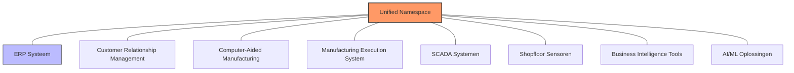

---
tags:
  - 'softwaredeployment-en-architectuur'
  - 'digitale-transformatie-en-industrie-40-50'
  - '🧹draft'

title: ERP als systeemnode
---
*ERP als systeemnode* beschrijft waarom ERP-systemen onderdeel moeten zijn van een bredere digitale strategie, niet de centrale spil waar alles omheen draait. Deze benadering is essentieel voor succesvolle digitale transformatie.

## Het grote misverstand

Veel organisaties maken de fundamentele fout om ERP centraal te zetten in hun digitale strategie. Ze denken dat als hun ERP-systeem up-to-date is, hun digitale transformatie geslaagd is. Dit is een gevaarlijke misconceptie die leidt tot rigide, moeilijk aanpasbare systemen.

Walker Reynolds waarschuwt expliciet voor deze ERP-centrische benadering in de metalworking industry:
> "Being ERP-centric is going to give you lots of challenges eventually."

Het probleem is dat ERP-systemen designed zijn als monolithische oplossingen die eigendom claimen over bedrijfsprocessen. In werkelijkheid moet ERP functioneren als één component binnen een groter digitaal ecosysteem.

## ERP binnen het grotere geheel

In een moderne industriële architectuur staat de [[unified-namespace|Unified Namespace]] centraal, niet het ERP-systeem. Het UNS fungeert als de centrale informatielaag waar alle systemen aan verbonden zijn. ERP wordt daarmee één van de vele nodes die data publiceert naar en consumeert van deze namespace.

Deze architectuur zorgt ervoor dat geen enkel systeem dominant wordt. ERP levert waardevolle business informatie, maar het dicteert niet hoe andere systemen moeten opereren of communiceren.

## Van eigendom naar functie

De belangrijkste paradigmashift is om ERP te behandelen als een **bedrijfsfunctie** in plaats van als een **eigendomssysteem**. Dit betekent dat ERP zijn rol vervult binnen de organisatie zonder te bepalen hoe andere systemen werken.

Tesla's WARP-systeem illustreert perfect hoe dit werkt. WARP is geen traditioneel ERP-monoliet, maar een digitale infrastructuur waarop ERP-functies draaien. Walker Reynolds legt uit:
> "WARP is not their ERP system actually. WARP is their digital infrastructure upon which they have ERP functions."

Deze benadering geeft Tesla de flexibiliteit om hun business logic aan te passen zonder gevangen te zitten in vendor-specifieke beperkingen. Ze hebben controle over hun digitale infrastructuur terwijl ze standaard ERP-functionaliteiten gebruiken waar nodig.

## Wat ERP wel bijdraagt

ERP-systemen hebben zonder twijfel waarde binnen een digitale architectuur. Ze bevatten kritieke bedrijfsinformatie die nodig is voor holistische besluitvorming. Het ERP-systeem weet de structuur van je organisatie, welke producten je maakt, wat de kosten zijn, en hoe processen georganiseerd zijn.

Deze informatie is essentieel voor AI en ML systemen die optimale beslissingen moeten maken. Een machine learning algoritme dat productie optimaliseert heeft niet alleen sensordata nodig, maar ook financiële context. Wat kost het om deze machine stil te zetten? Wat is de waarde van het product dat geproduceerd wordt? Deze antwoorden komen uit het ERP-systeem.

Het verschil is dat deze informatie beschikbaar moet komen via de [[unified-namespace|Unified Namespace]], niet via directe koppelingen naar het ERP. Het ERP publiceert zijn data naar de namespace, en andere systemen consumeren wat ze nodig hebben. Op deze manier blijft het ERP een waardevolle informatiebron zonder dominant te worden in de architectuur.

## Praktische implementatie

Wanneer je een digitale transformatie plant, begin je niet met ERP. Je start met het verbinden van je operationele systemen, het verzamelen van real-time data, en het bouwen van een [[unified-namespace|Unified Namespace]] als centrale informatielaag.

Het ERP-systeem wordt pas relevant wanneer je moderne API's nodig hebt om bedrijfsdata te integreren. Dit gebeurt meestal rond jaar drie van een digitale transformatie traject. Dan upgrade je het ERP niet omdat het de kern van je strategie is, maar omdat je betere interfaces nodig hebt om data te delen.

Walker Reynolds benadrukt dit timing aspect:
> "ERP upgrades typically come around year 3 of a 3-5 year digital transformation journey"

Deze timing zorgt ervoor dat je ERP-upgrade onderdeel wordt van een bredere strategie, in plaats van de drijvende kracht erachter.

## De uitdaging van real-time profitability

Een van de krachtigste toepassingen van juiste ERP-integratie is real-time profitability tracking. Stel je voor dat je per machine, per shift kunt zien wat de operationele kosten zijn en welke revenue er gegenereerd wordt. Dit geeft een volledig nieuwe dimensie aan productieoptimalisatie.

Traditionele OEE-metingen vertellen je hoe efficiënt een machine draait, maar zeggen niets over de financiële impact. Een machine kan 95% OEE hebben maar tegelijkertijd verlies draaien door hoge energiekosten of dure materialen. Alleen door ERP-data te combineren met operationele data krijg je dit complete beeld.

De uitdaging is dat deze berekeningen moeten gebeuren in real-time, niet achteraf in maandrapportages. Dit vereist dat alle financiële informatie uit het ERP beschikbaar is in je [[unified-namespace|Unified Namespace]], zodat AI-systemen direct kunnen reageren op veranderende profitability.

## Verschillende niveaus, verschillende behoeften

ERP-systemen opereren op verschillende organisatieniveaus, en elk niveau heeft andere informatiebehoefte. Op enterprise niveau gaat het om strategische planning en budgettering. Op plant niveau draait het om dagelijkse operaties en resource-allocatie.

Het probleem ontstaat wanneer één ERP-systeem probeert alle niveaus te bedienen met dezelfde interface. Dit leidt tot compromissen waarbij niemand echt krijgt wat ze nodig hebben. Een betere benadering is om ERP-data beschikbaar te maken via de namespace, zodat elk niveau de informatie kan consumeren op de manier die voor hen het meest nuttig is.

Operators op de werkvloer hebben andere visualisaties nodig dan executives in de boardroom, maar beiden kunnen putten uit dezelfde onderliggende datasets die het ERP-systeem publiceert.

## Gerelateerde begrippen

- [[unified-namespace|Unified Namespace (UNS)]] - Architecturale context
- [[enterprise-resource-planning|Enterprise Resource Planning (ERP)]] - ERP fundamentals
- [[digitale-transformatie|Digitale transformatie]] - Strategic framework
- [[event-gedreven-architectuur|Event-gedreven architectuur]] - Communication patterns
- [[manufacturing-execution-system|Manufacturing Execution System (MES)]] - Production coordination
- [[single-source-of-truth|Single Source of Truth (SSOT)]] - Data architecture principles

---
← Terug naar [[kaarten/softwaredeployment-en-architectuur|Softwaredeployment & Architectuur kaart]]