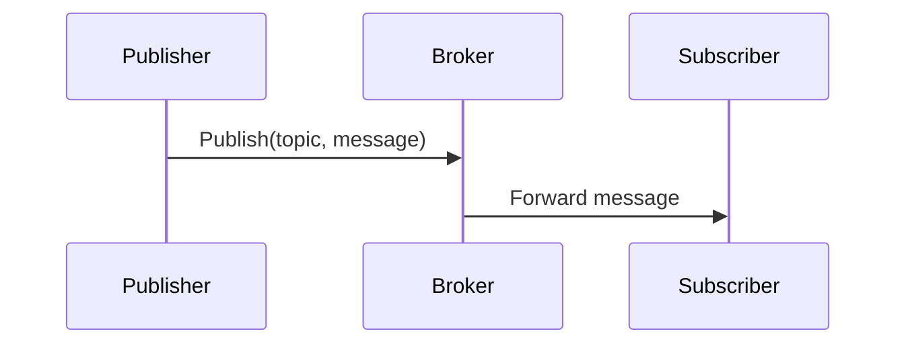
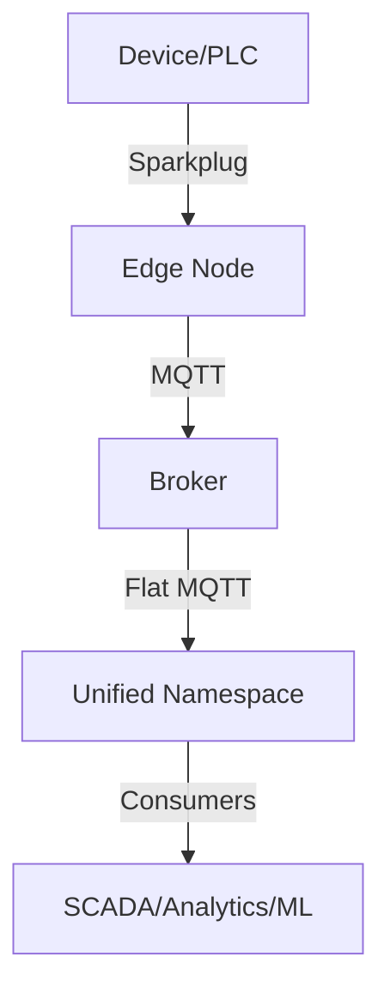

---
tags:
  - 'industriële-communicatieprotocollen'
  - '🧹draft'

title: Message Queuing Telemetry Transport (MQTT)
---
# Message Queuing Telemetry Transport (MQTT)

_Message Queuing Telemetry Transport (MQTT)_ is een lightweight messaging protocol (lichtgewicht berichtenprotocol) dat speciaal is ontworpen voor machine-to-machine communicatie in omgevingen met beperkte bandbreedte en onbetrouwbare netwerkverbindingen.

> [!important] Protocol vs Broker MQTT is het **protocol**, niet de broker. Een broker is slechts één component binnen de grotere MQTT-architectuur, net zoals UNS geen broker is maar een fabric (weefsel) of architectuur voor het organiseren van industriële data.

## Definitie

MQTT (Message Queuing Telemetry Transport) is een lightweight, publish/subscribe messaging protocol (lichtgewicht publiceer/abonneer berichtenprotocol) uitgevonden in 1999 door Andy Stanford-Clark (IBM) en Arlen Nipper (Cirrus Link). Het werd gecreëerd om het specifieke en kostbare probleem op te lossen van het monitoren van oliepijpleidingen en afgelegen industriële apparatuur via onbetrouwbare satellietverbindingen. Door gebruik te maken van een **report by exception model** (rapportage bij uitzondering model), verzonden apparaten alleen data wanneer er veranderingen optraden, wat de satelliet bandbreedte kosten drastisch reduceerde.

MQTT is sindsdien geëvolueerd tot een breed geaccepteerd protocol voor IoT, industriële automatisering en enterprise messaging (bedrijfsberichten), ondersteund door meerdere versies en uitbreidingen.

## Geschiedenis & Tijdlijn

- **1999** — Uitgevonden voor oliepijplijn monitoring via satelliet (IBM + Cirrus Link)
- **2010** — Breed geaccepteerd in IoT onderzoek en hobbyprojecten
- **2013** — Gestandaardiseerd door OASIS als open protocol
- **2014** — MQTT 3.1.1 uitgebracht (stabiel, minimale featureset)
- **2016–2017** — Sparkplug A, daarna Sparkplug B geïntroduceerd voor industriële OT
- **2019** — MQTT 5.0 uitgebracht (enterprise-gerichte verbeteringen)
- **2020s** — Unified Namespace (UNS) patronen ontstaan, gebruikmakend van MQTT als transport fabric

## Waarom MQTT bestaat

Traditionele communicatieprotocollen zoals HTTP en directe device polling (apparaat polling) lijden onder beperkingen in IoT en industriële contexten:

- **Always-on connections (Altijd-aan verbindingen)**: Apparaten moeten constant pollen
- **High overhead (Hoge overhead)**: Verbinding setup en headers verbruiken bandbreedte
- **Client-server coupling (Client-server koppeling)**: Apparaten moeten specifieke endpoints kennen
- **No real-time push (Geen real-time push)**: Servers kunnen geen communicatie initiëren
- **Bandwidth waste (Bandbreedte verspilling)**: Polling verspilt netwerkbronnen
- **Scalability issues (Schaalbaarheids problemen)**: Elke consumer vereist aparte polling verbindingen
- **Network inefficiency (Netwerk inefficiëntie)**: Meerdere clients pollen dezelfde bron

MQTT lost deze problemen op door **producers en consumers te ontkoppelen** via een **broker** die berichten routeert via topics (onderwerpen).

## Hoe MQTT werkt

**Kernarchitectuur:**

```
Publisher (Uitgever) → MQTT Broker → Subscriber(s) (Abonnee(s))
```

**Kernconcepten:**

- **Publishers** sturen berichten naar topics
- **Subscribers** ontvangen berichten van geabonneerde topics
- **Broker** handelt routing en delivery (levering) af
- Publishers en subscribers communiceren nooit direct

**Topics (Onderwerpen):** Hiërarchische kanalen zoals:

```
factory/line1/temperature
factory/line1/pressure
factory/line2/temperature
```

**QoS Levels (QoS Niveaus):**

- **QoS 0** – "Fire and forget" (vuur en vergeet), geen garantie
- **QoS 1** – "At least once" (ten minste eenmaal), kan duplicaten leveren
- **QoS 2** – "Exactly once" (exact eenmaal), hoogste garantie en overhead

**Andere Features:**

- **Retained Messages (Behouden berichten)**: Broker bewaart laatste bericht voor nieuwe subscribers
- **Last Will & Testament (LWT)**: Bericht verzonden als client onverwacht disconnecteert
- **Session Persistence (Sessie persistentie)**: Hervat subscriptions na reconnectie
- **Keep Alive**: Detecteert verbroken verbindingen

## MQTT Voordelen

### Voor IoT/Industriële Toepassingen

- **Bandbreedte efficiënt**: 2-byte header
- **Decoupled architecture (Ontkoppelde architectuur)**: Publishers hoeven subscribers niet te kennen
- **Real-time push**: Directe berichtlevering bij data veranderingen
- **Network resilience (Netwerk veerkracht)**: Ontworpen voor onbetrouwbare netwerken

### Voor Schaalbaarheid

- **Many-to-many communicatie**: Meerdere publishers kunnen meerdere subscribers voeden
- **Topic-based routing**: Fijnmazige controle over wie welke data krijgt
- **Broker clustering**: Horizontale schaalbaarheid voor enterprise deployments

### Voor Betrouwbaarheid

- **QoS levels**: Keuze van juiste delivery guarantees (leveringsgaranties)
- **Retained messages**: Behouden berichten
- **Session persistence**: Sessie persistentie
- **Keep alive mechanism**: Keep alive mechanisme

## MQTT Versies

### MQTT 3.1.1 (2014)

> [!success] Stabiele en breed geaccepteerde versie De stabiele en breed geaccepteerde versie die de basis werd voor de meeste IoT implementaties.

**Kenmerken:**

- **Eenvoudig, bewezen protocol**
- **Brede industriële ondersteuning**
- **Minimale featureset** gefocust op core messaging (kernberichten)
- **Specificatie ~80 pagina's**

### MQTT 5.0 (2019)

> [!note] Enhanced versie Enhanced versie die enterprise features en verbeterde schaalbaarheid toevoegt.

**Belangrijke verschillen:**

**1. Enhanced Error Handling (Verbeterde Foutafhandeling)**

- **MQTT 3.1.1**: Basis return codes, beperkte error informatie
    - CONNACK: 0=Success, 1=Unacceptable protocol, 2=Identifier rejected...
- **MQTT 5.0**: Gedetailleerde reason codes en menselijk leesbare error strings
    - CONNACK: 0x80=Unspecified error, 0x81=Malformed packet, 0x82=Protocol error...
    - Optionele reason string, bijvoorbeeld "Invalid client certificate"

**2. User Properties (Gebruikerseigenschappen)**

- **MQTT 3.1.1**: Geen custom metadata ondersteuning
- **MQTT 5.0**: Key-value pairs voor custom metadata
- **Voorbeeld**:

```json
[
  {"deviceType": "temperature_sensor"},
  {"location": "Building_A_Floor_2"},
  {"firmwareVersion": "1.2.3"}
]
```

**3. Message Expiry (Bericht Vervaltijd)**

- **MQTT 3.1.1**: Berichten leven voor altijd (tot geleverd)
- **MQTT 5.0**: Tijdgebaseerde message expiration
- **Voorbeeld**: Expiry interval = 3600 seconden (bericht weggegooid als niet geleverd binnen 1 uur)

**4. Request/Response Pattern**

- **MQTT 3.1.1**: Alleen publish/subscribe (geen native request/response)
- **MQTT 5.0**: Ingebouwde request/response ondersteuning
    - Request Topic: device/command
    - Response Topic: device/response/client123
    - Correlation Data: request_id_456

**5. Shared Subscriptions (Gedeelde Abonnementen)**

- **MQTT 3.1.1**: Alle subscribers ontvangen alle berichten
- **MQTT 5.0**: Load balancing tussen subscriber groepen
    - Normaal: factory/sensors → alle subscribers krijgen alle berichten
    - Shared: $share/workers/factory/sensors → berichten gedistribueerd tussen groep

**6. Topic Aliases (Onderwerp Aliassen)**

- **MQTT 3.1.1**: Volledige topic naam opgenomen in elk bericht
- **MQTT 5.0**: Numerieke aliassen reduceren bandbreedte
- **Voorbeeld**: Eerste bericht → Topic=factory/line1/temperature/sensor1, Alias=1
    - Vervolgberichten → Topic=leeg, Alias=1

**7. Flow Control (Stroomcontrole)**

- **MQTT 3.1.1**: Basis flow control via QoS
- **MQTT 5.0**: Geavanceerde flow control mechanismen
    - Receive Maximum: Beperkt gelijktijdige QoS 1 & 2 berichten
    - Maximum Packet Size: Voorkomt oversized berichten

**8. Enhanced Authentication (Verbeterde Authenticatie)**

- **MQTT 3.1.1**: Eenvoudige username/password alleen
- **MQTT 5.0**: Enhanced authentication methoden
    - Method: SCRAM-SHA-256
    - Authentication Data
    - Ondersteuning voor OAuth, Kerberos, etc.

### Wanneer welke versie gebruiken

**Kies MQTT 3.1.1 wanneer:**

- Je een eenvoudig, bewezen protocol nodig hebt met brede industriële ondersteuning
- Je use case alleen basis messaging features vereist
- Resource-constrained devices (resource-beperkte apparaten) gebruikt worden waar minimale overhead essentieel is
- Je een lightweight specificatie (80 pagina's) wilt gefocust op core messaging

**Kies MQTT 5.0 wanneer:**

- Je advanced error handling en diagnostics nodig hebt
- Je custom metadata wilt toevoegen aan berichten via user properties
- Je message expiry of request/response patterns vereist
- Je shared subscriptions nodig hebt voor load balancing
- Je topic aliases wilt voor bandbreedte reductie
- Je flow control en limieten nodig hebt voor concurrent message handling (gelijktijdige berichtafhandeling)
- Je enhanced authentication methoden vereist zoals OAuth, Kerberos, of SCRAM-SHA-256

## Sparkplug B (2017)

> [!tip] Industriële specificatie Specificatie bovenop MQTT voor industriële procescontrole.

**Kenmerken:**

- **Gestandaardiseerde topic namespace**
- **Protobuf payload encoding (Protobuf payload codering)**
- **Continue session state (birth/death certificates, sequence numbers)**
- **Best geschikt voor OT device-level data**

## Toepassingen

- **Industrial Telemetry (Industriële Telemetrie)**: PLC/RTU communicatie, SCADA links
- **Remote Monitoring (Remote Monitoring)**: Pijpleidingen, utilities, infrastructuur
- **IoT Devices**: Sensor netwerken, edge devices
- **Enterprise Messaging**: Integratie van IT en OT data flows
- **Analytics**: Real-time data voeden naar machine learning pipelines
- **UNS**: Gebruikt als transport fabric binnen een Unified Namespace

## Vergelijkingstabel

|Feature|MQTT 3.1.1|MQTT 5.0|Sparkplug B|
|---|---|---|---|
|Error Handling|Basis return codes|Gedetailleerde reason codes|Hetzelfde als 5.0|
|User Properties|Geen|Key-value metadata|Gestructureerde Protobuf|
|Message Expiry|Geen|Tijdgebaseerde expiry|Continue session awareness|
|Request/Response|Niet native|Ondersteund|Niet native (afgehandeld via payloads)|
|Shared Subscriptions|Geen|Load-balanced groepen|Geen (Sparkplug gebruikt topic hierarchy)|
|Topic Aliases|Geen|Numerieke aliassen|Gestructureerde namespace|
|Flow Control|Alleen basis QoS|Receive Max, Packet Size|QoS + session awareness|
|Authentication|Username/password|Enhanced (SCRAM, OAuth, Kerberos)|Hetzelfde als 5.0 + lifecycle awareness|
|State Management|Geen|Beperkt|Birth/Death, Sequence, State|

## Rol in Unified Namespace (UNS)

> [!info] UNS is geen broker UNS is **geen broker**. Het is een **architecture fabric** voor contextuele, stateful data uitwisseling.
> 
> - Een broker is slechts één component binnen de UNS
> - MQTT 3, 5, en Sparkplug bevatten allemaal data quality, waardoor stale values (verouderde waarden) gedetecteerd kunnen worden
> - **UNS = State** (status); een historian slaat **state over tijd** op

**Pattern (Patroon):** Gebruik Sparkplug alleen voor device-level messaging → Parse Sparkplug naar **flat MQTT** zodra opgenomen in de UNS (kan gedaan worden met HiveMQ modules).

### Topic Namespace Structure

```
Company/Site/Area/Line/Asset/DataType/Parameter
VanEnkhuizen/Rotterdam/Productie/Lijn1/Oven001/Temperature/Actual
VanEnkhuizen/Rotterdam/Productie/Lijn1/Oven001/Status/Operational
```

### UNS Data Architecture

- **Topic namespace** als backbone van UNS
- **Event-driven updates** voor real-time data synchronization
- **Retained messages** voor current state representation
- **Wildcard subscriptions** voor flexible data consumption

## Sparkplug B Integration

> [!tip] Quality Information MQTT 3.1.1, 5.0 en Sparkplug B dragen allemaal quality information mee met het bericht, waardoor het eenvoudig wordt om stale values te detecteren.

**Sparkplug en Device Data:**

- **Sparkplug B is meest nuttig** op device level voor data en control
- **Zodra data de UNS bereikt**, kunnen Sparkplug payloads geparsed worden naar flat MQTT topics voor bredere consumptie
- **Deze parsing is eenvoudig** - bijvoorbeeld met een simpele HiveMQ module om automatisch Sparkplug B (spB) om te zetten naar flat MQTT references

### Praktische Benadering

**Gebruik Sparkplug B alleen waar het het sterkst is:**

- Device en edge-level communicatie
- Lifecycle state management (birth/death certificates)
- Gestandaardiseerde metric payloads

**Transformeer Sparkplug naar flat MQTT** op de UNS boundary om:

- References te vereenvoudigen
- Accessibility (toegankelijkheid) te verbeteren voor non-Sparkplug-aware consumers
- State te behouden terwijl flexible downstream usage mogelijk wordt

### Sparkplug Specification

MQTT Sparkplug extends basic MQTT voor industriële UNS:

```
spBv1.0/group_id/message_type/edge_node_id/device_id
spBv1.0/ACME/DDATA/ProductieLijn_A/Oven_1
```

**Sparkplug benefits:**

- **Standardized payload format** (Protobuf)
- **Birth/Death certificates** voor session management
- **Timestamp synchronization** voor temporal accuracy
- **Data type definitions** voor semantic interoperability

## MQTT Viewer Tools (Open Source)

- **MQTT Explorer** — Cross-platform MQTT client met gestructureerde topic tree view
- **MQTTX** — Krachtige en moderne MQTT 5.0 desktop client
- **MQTTLens** — Chrome extensie voor snelle MQTT testing
- **Mosquitto Clients** — Onderdeel van het Eclipse Mosquitto project (CLI-based)
- **HiveMQ MQTT Client** — Java-gebaseerde open-source client library

## Performance Karakteristieken

### Throughput Capabilities

- **Hoge message throughput** (>100k messages/second)
- **Low latency** communication (<10ms typical)
- **Efficient bandwidth usage** door protocol optimization
- **Scalable connection management** (thousands of concurrent clients)

### Resource Efficiency

- **Minimal memory footprint** op embedded devices
- **Low CPU usage** voor protocol processing
- **Battery-friendly** voor wireless IoT devices
- **Bandwidth efficient** voor cellular/satellite connections

## Diagrammen





## Gerelateerde begrippen

- [[Broker]]: EMQX, Mosquitto, HiveMQ, VerneMQ
- [[QoS Levels]]
- [[Report by Exception]]
- [[unified-namespace|Unified Namespace (UNS)]]
- [[SCADA]] integration
- [[Protobuf encoding]] (gebruikt in Sparkplug B)
- [[Edge Node]] vs [[Device]]
- [[topic-namespace|Topic namespace]]
- [[event-gedreven-architectuur|Event-gedreven architectuur]]
- [[mqtt-broker|MQTT-broker]]
- [[publish-subscribe-messaging|Publish/Subscribe messaging]]
- [[internet-of-things|Internet of Things (IoT)]]
- [[industrial-internet-of-things|Industrial Internet of Things (IIoT)]]
- [[event-broker|Event broker]]
- [[sparkplug-b|Sparkplug B]]

## Bronnen

- MQTT Version 5.0 Specification (OASIS Standard)\n- MQTT Sparkplug Specification v3.0\n- Eclipse Mosquitto - Open source MQTT broker\n- Eclipse Paho - MQTT client libraries\n- HiveMQ - Enterprise MQTT platform documentation\n- AWS IoT Core - MQTT service documentation\n- Industrial Internet Consortium MQTT best practices

---

← Terug naar [[kaarten/industriële-communicatieprotocollen|Industriële communicatieprotocollen kaart]]